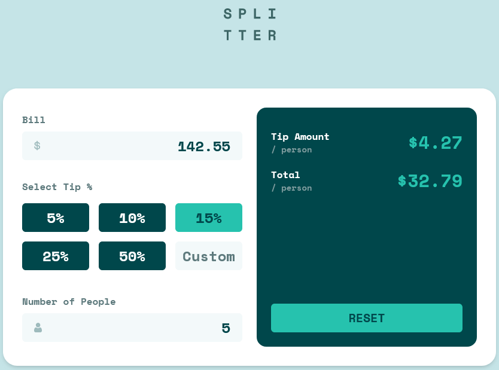

# Frontend Mentor - Tip calculator app solution

This is a solution to the [Tip calculator app challenge on Frontend Mentor](https://www.frontendmentor.io/challenges/tip-calculator-app-ugJNGbJUX). Frontend Mentor challenges help you improve your coding skills by building realistic projects.

## Table of contents

- [Overview](#overview)
  - [The challenge](#the-challenge)
  - [Screenshot](#screenshot)
  - [Links](#links)
- [My process](#my-process)
  - [Built with](#built-with)
- [Author](#author)

## Overview

### The challenge

Users should be able to:

- View the optimal layout for the app depending on their device's screen size
- See hover states for all interactive elements on the page
- Calculate the correct tip and total cost of the bill per person

### Screenshot

### Links

- Solution URL: [Solution](https://www.frontendmentor.io/solutions/tipping-calculator-built-with-tailwind-and-vue-vzWm_Rh-vt)
- Live Site URL: [Live Site](https://tipping-calculator.netlify.app)

### Built with

- [Inertia](https://inertiajs.com)
- [Vite](https://vitejs.dev/)
- [Tailwind](https://tailwindcss.com/)

## Author

- Website - [Lee Connelly](leeconnelly.dev/)
- Frontend Mentor - [@LeeConnelly12](https://www.frontendmentor.io/profile/LeeConnelly12)
